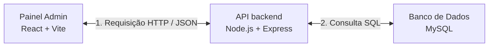

# Guia de Integração: Conectando a Aba de Usuários ao Banco de Dados 🌐

Este guia apresenta o caminho de arquitetura e o passo a passo prático para conectar a aba **Usuários** do seu Painel Administrativo (React/Vite) ao seu banco de dados MySQL (`VITRINE_NORMITH`) através da sua API (Express/Node.js).

Com essa integração, você poderá criar, ler, atualizar e excluir usuários diretamente do painel, em tempo real.

---

## 📐 Fluxo da Arquitetura

O fluxo de comunicação segue o padrão cliente-servidor moderno:



---

## 🚦 Fase 1: Preparação do Backend (`backend/api`)

Para lidar com a segurança das senhas dos novos usuários diretamente na API, precisamos instalar a biblioteca de criptografia **Bcrypt.js**.

### 1. Instalar a biblioteca
Abra o seu terminal na pasta da API (`backend/api`) e execute:
```bash
npm install bcryptjs
```

### 2. Dica Importante: Conflito de Portas ⚠️
No seu arquivo [backend/api/.env](file:///c:/Users/MatthewOS/Programs/Houston_2-SEM/backend/api/.env), a variável `PORT` está definida como `3306`.
* **Atenção:** `3306` é a porta padrão onde o próprio banco de dados MySQL está rodando!
* **Recomendação:** Altere a porta da API no arquivo `.env` para `5000` (ou qualquer outra porta livre) para evitar conflitos na sua máquina:
  ```env
  PORT=5000
  ```

---

## 🛠️ Fase 2: Criando as Rotas na API (`backend/api/src/server.js`)

Adicione estas rotas ao seu arquivo do servidor para que o frontend possa consultar e salvar dados no MySQL.

```javascript
import bcrypt from 'bcryptjs';

// ==========================================
// ROTAS DE GERENCIAMENTO DE USUÁRIOS
// ==========================================

// 1. Listar Usuários (GET)
app.get('/api/usuarios', async (req, res) => {
  try {
    // IMPORTANTE: Selecionamos apenas os campos necessários, OMITINDO o hash da senha por segurança!
    const [linhas] = await db.query('SELECT ID_USUARIO, NOME, EMAIL, TIPO, CRIADO_EM FROM USUARIOS');
    res.status(200).json(linhas);
  } catch (error) {
    console.error('Erro ao buscar usuários:', error.message);
    res.status(500).json({ error: 'Erro ao buscar usuários no banco de dados.' });
  }
});

// 2. Cadastrar Novo Usuário (POST)
app.post('/api/usuarios', async (req, res) => {
  try {
    const { NOME, EMAIL, SENHA, TIPO } = req.body;

    if (!NOME || !EMAIL || !SENHA) {
      return res.status(400).json({ error: 'Preencha todos os campos obrigatórios (nome, e-mail e senha).' });
    }

    // Geramos o hash seguro Bcrypt da senha digitada
    const saltRounds = 10;
    const senhaCriptografada = await bcrypt.hash(SENHA, saltRounds);

    const sql = 'INSERT INTO USUARIOS (NOME, EMAIL, SENHA, TIPO) VALUES (?, ?, ?, ?)';
    const [resultado] = await db.query(sql, [NOME, EMAIL, senhaCriptografada, TIPO || 'colaborador']);

    res.status(201).json({
      mensagem: 'Usuário cadastrado com sucesso!',
      id_usuario: resultado.insertId
    });
  } catch (error) {
    console.error('Erro ao cadastrar usuário:', error.message);
    // Trata erro de e-mail duplicado
    if (error.code === 'ER_DUP_ENTRY') {
      return res.status(400).json({ error: 'Este e-mail já está cadastrado no sistema.' });
    }
    res.status(500).json({ error: 'Erro ao salvar usuário no banco de dados.' });
  }
});

// 3. Deletar Usuário (DELETE)
app.delete('/api/usuarios/:id', async (req, res) => {
  try {
    const { id } = req.params;

    const sql = 'DELETE FROM USUARIOS WHERE ID_USUARIO = ?';
    const [resultado] = await db.query(sql, [id]);

    if (resultado.affectedRows === 0) {
      return res.status(404).json({ error: 'Usuário não encontrado.' });
    }

    res.status(200).json({ mensagem: 'Usuário removido com sucesso!' });
  } catch (error) {
    console.error('Erro ao deletar usuário:', error.message);
    res.status(500).json({ error: 'Erro ao remover usuário do banco de dados.' });
  }
});
```

---

## 💻 Fase 3: Conectando a View no React (`backend/admin_panel/src/components/views/Users.jsx`)

Para que a tela de gerenciamento de usuários exiba e manipule dados reais, precisamos converter o componente em dinâmico com **Hooks do React (`useState`, `useEffect`)** e usar a função global `fetch`.

Abaixo está o modelo de implementação prática para o seu componente:

```jsx
import React, { useState, useEffect } from 'react';

export default function UsuariosView() {
  // Estado para armazenar os usuários carregados da API
  const [users, setUsers] = useState([]);
  const [loading, setLoading] = useState(true);
  const [error, setError] = useState(null);

  // Estados para o formulário de cadastro de novos usuários
  const [formData, setFormData] = useState({ nome: '', email: '', senha: '', tipo: 'colaborador' });
  const [showModal, setShowModal] = useState(false);

  // URL da sua API Backend
  const API_URL = 'http://localhost:5000/api/usuarios';

  // 🔄 Função para buscar os usuários no banco de dados
  const fetchUsers = async () => {
    try {
      setLoading(true);
      const response = await fetch(API_URL);
      if (!response.ok) throw new Error('Não foi possível obter os dados da API.');
      const data = await response.json();
      setUsers(data);
    } catch (err) {
      setError(err.message);
    } finally {
      setLoading(false);
    }
  };

  // Carrega os usuários assim que o componente abre na tela
  useEffect(() => {
    fetchUsers();
  }, []);

  // ➕ Função para salvar um novo usuário no banco
  const handleAddUser = async (e) => {
    e.preventDefault();
    try {
      const response = await fetch(API_URL, {
        method: 'POST',
        headers: { 'Content-Type': 'application/json' },
        body: JSON.stringify({
          NOME: formData.nome,
          EMAIL: formData.email,
          SENHA: formData.senha,
          TIPO: formData.tipo
        })
      });

      const result = await response.json();
      if (!response.ok) throw new Error(result.error || 'Erro ao cadastrar usuário.');

      alert('Usuário cadastrado com sucesso!');
      setFormData({ nome: '', email: '', senha: '', tipo: 'colaborador' });
      setShowModal(false);
      fetchUsers(); // Recarrega a tabela de usuários
    } catch (err) {
      alert(err.message);
    }
  };

  // ❌ Função para remover um usuário do banco
  const handleDeleteUser = async (id) => {
    if (!confirm('Deseja realmente excluir este usuário permanentemente?')) return;
    try {
      const response = await fetch(`${API_URL}/${id}`, { method: 'DELETE' });
      const result = await response.json();
      
      if (!response.ok) throw new Error(result.error || 'Erro ao deletar usuário.');

      alert(result.mensagem);
      fetchUsers(); // Recarrega a lista atualizada
    } catch (err) {
      alert(err.message);
    }
  };

  if (loading) return <div className="text-slate-500 font-semibold p-6">Carregando usuários do banco de dados...</div>;
  if (error) return <div className="text-rose-500 font-semibold p-6">Erro: {error}</div>;

  return (
    <div className="bg-white rounded-2xl border border-slate-100 shadow-xs p-6">
      {/* Cabeçalho */}
      <div className="flex justify-between items-center mb-6">
        <h4 className="text-lg font-bold text-slate-800">Gerenciamento de Usuários (Banco de Dados)</h4>
        <button 
          onClick={() => setShowModal(true)} 
          className="bg-blue-600 hover:bg-blue-700 text-white text-sm font-semibold px-4 py-2 rounded-xl transition flex items-center gap-2 cursor-pointer"
        >
          Adicionar Usuário
        </button>
      </div>

      {/* Tabela de Usuários Reais */}
      <div className="overflow-x-auto">
        <table className="w-full text-left border-collapse">
          <thead>
            <tr className="border-b border-slate-100 text-slate-400 text-xs font-semibold uppercase">
              <th className="py-3 px-4">Nome</th>
              <th className="py-3 px-4">E-mail</th>
              <th className="py-3 px-4">Cargo</th>
              <th className="py-3 px-4 text-right">Ações</th>
            </tr>
          </thead>
          <tbody className="divide-y divide-slate-50 text-sm text-slate-700">
            {users.map((user) => (
              <tr key={user.ID_USUARIO} className="hover:bg-slate-50/50">
                <td className="py-4 px-4 font-bold text-slate-900">{user.NOME}</td>
                <td className="py-4 px-4 text-slate-500">{user.EMAIL}</td>
                <td className="py-4 px-4">
                  <span className={`px-2.5 py-1 rounded-full text-xs font-semibold ${
                    user.TIPO === 'admin' ? 'bg-blue-50 text-blue-700' : 'bg-slate-100 text-slate-600'
                  }`}>
                    {user.TIPO}
                  </span>
                </td>
                <td className="py-4 px-4 text-right">
                  <button 
                    onClick={() => handleDeleteUser(user.ID_USUARIO)} 
                    className="text-rose-500 hover:text-rose-700 font-semibold text-sm cursor-pointer"
                  >
                    Excluir
                  </button>
                </td>
              </tr>
            ))}
          </tbody>
        </table>
      </div>

      {/* Modal Simples de Cadastro */}
      {showModal && (
        <div className="fixed inset-0 bg-slate-900/40 backdrop-blur-xs flex items-center justify-center z-50">
          <form onSubmit={handleAddUser} className="bg-white p-6 rounded-2xl w-full max-w-md border border-slate-100">
            <h5 className="text-lg font-bold text-slate-800 mb-4">Adicionar Novo Usuário</h5>
            
            <div className="flex flex-col gap-4">
              <input 
                type="text" 
                placeholder="Nome Completo" 
                required 
                className="border p-2 rounded-xl"
                value={formData.nome}
                onChange={(e) => setFormData({ ...formData, nome: e.target.value })}
              />
              <input 
                type="email" 
                placeholder="E-mail" 
                required 
                className="border p-2 rounded-xl"
                value={formData.email}
                onChange={(e) => setFormData({ ...formData, email: e.target.value })}
              />
              <input 
                type="password" 
                placeholder="Senha (Bcrypt autogerado)" 
                required 
                className="border p-2 rounded-xl"
                value={formData.senha}
                onChange={(e) => setFormData({ ...formData, senha: e.target.value })}
              />
              <select 
                className="border p-2 rounded-xl"
                value={formData.tipo}
                onChange={(e) => setFormData({ ...formData, tipo: e.target.value })}
              >
                <option value="colaborador">Colaborador</option>
                <option value="admin">Administrador</option>
              </select>
            </div>

            <div className="flex justify-end gap-3 mt-6">
              <button type="button" onClick={() => setShowModal(false)} className="text-slate-500 font-semibold">Cancelar</button>
              <button type="submit" className="bg-blue-600 text-white px-4 py-2 rounded-xl font-semibold">Salvar</button>
            </div>
          </form>
        </div>
      )}
    </div>
  );
}
```

---

## 🚀 Próximos Passos
1. **Instalar `bcryptjs`** na pasta do backend.
2. **Atualizar a porta** no arquivo `.env` para `5000` (evitando o conflito na porta MySQL `3306`).
3. **Colar o código das rotas** em `backend/api/src/server.js`.
4. **Colar o código dinâmico** na view em `backend/admin_panel/src/components/views/Users.jsx`.
